* Table of Contents
{:toc}

--------------------------------------------------------------------------------------------------------------------

## **Acknowledgements**

* {list here sources of all reused/adapted ideas, code, documentation, and third-party libraries -- include links to the original source as well}

--------------------------------------------------------------------------------------------------------------------

## **Setting up, getting started**

Refer to the guide [_Setting up and getting started_](SettingUp.md).

--------------------------------------------------------------------------------------------------------------------

## **Design**

:bulb: **Tip:** The `.puml` files used to create diagrams in this document can be found in the [diagrams](https://github.com/AY2223S1-CS2103-W14-2/tp/tree/master/docs/diagrams) folder. Refer to the [_PlantUML Tutorial_ at se-edu/guides](https://se-education.org/guides/tutorials/plantUml.html) to learn how to create and edit diagrams.

### Architecture

The ***Architecture Diagram*** given above explains the high-level design of the App.

Given below is a quick overview of main components and how they interact with each other.

**Main components of the architecture**

**`Main`** has two classes called [`Main`](https://github.com/AY2223S1-CS2103-W14-2/tp/blob/master/src/main/java/foodwhere/Main.java) and [`MainApp`](https://github.com/AY2223S1-CS2103-W14-2/tp/blob/master/src/main/java/foodwhere/MainApp.java). It is responsible for,
* At app launch: Initializes the components in the correct sequence, and connects them up with each other.
* At shut down: Shuts down the components and invokes cleanup methods where necessary.

[**`Commons`**](#common-classes) represents a collection of classes used by multiple other components.

The rest of the App consists of four components.

* [**`UI`**](#ui-component): The UI of the App.
* [**`Logic`**](#logic-component): The command executor.
* [**`Model`**](#model-component): Holds the data of the App in memory.
* [**`Storage`**](#storage-component): Reads data from, and writes data to, the hard disk.

**How the architecture components interact with each other**

The *Sequence Diagram* below shows how the components interact with each other for the scenario where the user issues the command `sdel 1`.

Each of the four main components (also shown in the diagram above),

* defines its *API* in an `interface` with the same name as the Component.
* implements its functionality using a concrete `{Component Name}Manager` class (which follows the corresponding API `interface` mentioned in the previous point.

For example, the `Logic` component defines its API in the `Logic.java` interface and implements its functionality using the `LogicManager.java` class which follows the `Logic` interface. Other components interact with a given component through its interface rather than the concrete class (reason: to prevent outside component's being coupled to the implementation of a component), as illustrated in the (partial) class diagram below.

The sections below give more details of each component.

### UI component

The **API** of this component is specified in [`Ui.java`](https://github.com/AY2223S1-CS2103-W14-2/tp/blob/master/src/main/java/foodwhere/ui/Ui.java)

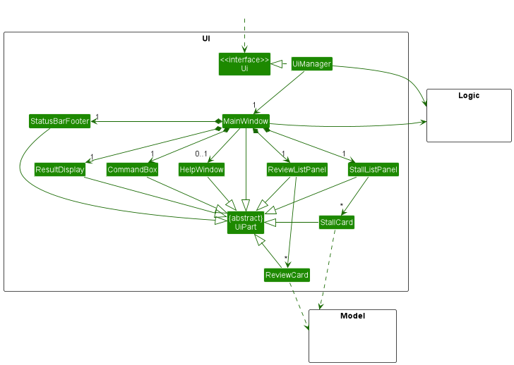

The UI consists of a `MainWindow` that is made up of parts e.g.`CommandBox`, `ResultDisplay`, `StallListPanel`, `ReviewListPanel`, `StatusBarFooter` etc. All these, including the `MainWindow`, inherit from the abstract `UiPart` class which captures the commonalities between classes that represent parts of the visible GUI.

The `UI` component uses the JavaFx UI framework. The layout of these UI parts are defined in matching `.fxml` files that are in the `src/main/resources/view` folder. For example, the layout of the [`MainWindow`](https://github.com/AY2223S1-CS2103-W14-2/tp/blob/master/src/main/java/foodwhere/ui/MainWindow.java) is specified in [`MainWindow.fxml`](https://github.com/AY2223S1-CS2103-W14-2/tp/blob/master/src/main/resources/view/MainWindow.fxml)

The `UI` component,

* executes user commands using the `Logic` component.
* listens for changes to `Model` data so that the UI can be updated with the modified data.
* keeps a reference to the `Logic` component, because the `UI` relies on the `Logic` to execute commands.
* depends on some classes in the `Model` component, as it displays `Stall` object residing in the `Model`.

### Logic component

**API** : [`Logic.java`](https://github.com/AY2223S1-CS2103-W14-2/tp/blob/master/src/main/java/foodwhere/logic/Logic.java)

Here's a (partial) class diagram of the `Logic` component:

How the `Logic` component works:
1. When `Logic` is called upon to execute a command, it uses the `AddressBookParser` class to parse the user command.
1. This results in a `Command` object (more precisely, an object of one of its subclasses e.g., `RAddCommand`) which is executed by the `LogicManager`.
1. The command can communicate with the `Model` when it is executed (e.g. to add a review).
1. The result of the command execution is encapsulated as a `CommandResult` object which is returned back from `Logic`.

The Sequence Diagram below illustrates the interactions within the `Logic` component for the `execute("delete 1")` API call.

:information_source: **Note:** The lifeline for `DeleteCommandParser` should end at the destroy marker (X) but due to a limitation of PlantUML, the lifeline reaches the end of diagram.

Here are the other classes in `Logic` (omitted from the class diagram above) that are used for parsing a user command:

How the parsing works:
* When called upon to parse a user command, the `AddressBookParser` class creates an `XYZCommandParser` (`XYZ` is a placeholder for the specific command name e.g., `RAddCommandParser`) which uses the other classes shown above to parse the user command and create a `XYZCommand` object (e.g., `RAddCommand`) which the `AddressBookParser` returns back as a `Command` object.
* All `XYZCommandParser` classes (e.g., `RAddCommandParser`, `RDeleteCommandParser`, ...) inherit from the `Parser` interface so that they can be treated similarly where possible e.g, during testing.

### Model component
**API** : [`Model.java`](https://github.com/AY2223S1-CS2103-W14-2/tp/blob/master/src/main/java/foodwhere/model/Model.java)

The `Model` component,

* stores the address book data i.e., all `Stall` objects (which are contained in a `UniqueStallList` object) and all `Review` objects (which are contained in a `UniqueReviewList` object).
* stores the currently 'selected' `Stall` and `Review` objects (e.g., results of a search query) as a separate _filtered_ list which is exposed to outsiders as an unmodifiable `ObservableList<Stall>` and `ObservableList<Review>` that can be 'observed' e.g. the UI can be bound to this list so that the UI automatically updates when the data in the list change.
* stores a `UserPref` object that represents the user’s preferences. This is exposed to the outside as a `ReadOnlyUserPref` objects.
* does not depend on any of the other three components (as the `Model` represents data entities of the domain, they should make sense on their own without depending on other components)

:information_source: **Note:** An alternative (arguably, a more OOP) model is given below. It has a `Tag` list in the `AddressBook`, which `Stall` references. This allows `AddressBook` to only require one `Tag` object per unique tag, instead of each `Stall` needing their own `Tag` objects. 

### Storage component

**API** : [`Storage.java`](https://github.com/AY2223S1-CS2103-W14-2/tp/blob/master/src/main/java/foodwhere/storage/Storage.java)

The `Storage` component,
* can save both address book data and user preference data in json format, and read them back into corresponding objects.
* inherits from both `AddressBookStorage` and `UserPrefStorage`, which means it can be treated as either one (if only the functionality of only one is needed).
* depends on some classes in the `Model` component (because the `Storage` component's job is to save/retrieve objects that belong to the `Model`)

### Common classes

Classes used by multiple components are in the `foodwhere.commons` package.

--------------------------------------------------------------------------------------------------------------------

## **Implementation**

This section describes some noteworthy details on how certain features are implemented.

### **Review Components**
* Added Classes into the model Component to encapsulate a Review

#### **Implementation**

A `Review`,
- is stored in `uniqueReviewList` of the Model

A `Review` contains the following attributes,
1. a `Name`, which represent the name of the Stall associated with the Review
2. a `Date`, which represent the day, month and year as specified in `DD/MM/YYYY` format
3. a `Content`, which represent the review of the Stall by the user
4. a `Rating`, which represent the rating of the Stall from 0 to 5 inclusive
5. can be assigned to a single `Stall`
6. can be assigned multiple `Tags`

#### Design considerations:

#### Aspect: How the components within Review are added or changed
- **Current Choice**: Attributes within `Review` are immutable, meaning that if there is an attribute that has to be edited, a new `Review` object has to be created.
    * Pros: Concept of Immutability is met, making the code less prone to bugs as all components of a `Review` object are fixed
    * Cons: Less flexible, more steps needed in editing `Review` objects
- Alternative 1: Allow certain components within `Review`, like `Date` and `Content`to be mutable
    * Pros: Less overhead as fewer objects are created
    * Cons: Prone to error as a Component might not be correctly changed

### Review Adding feature

#### What is Review Adding feature about?

The Add Review mechanism is facilitated by `AddressBook`. This feature enhances `AddressBook` by allowing to store not only `Stall`, but also `Review`. This is stored internally as a `UniqueStallList` and `UniqueReviewList`. `Review` requires a `Stall` as `Review` is stored in `Stall`. Additionally, the feature implements the following operations:

* `AddressBook#addReview(Review)` —  Adds the `Review` to `UniqueReviewList`

For the command, the feature extends `command`, and is implemented as such:
* `radd s/STALL_INDEX d/DATE c/CONTENT r/RATING [t/TAGS]…`

#### Implementation Flow of Review Adding feature

Given below is an example usage scenario and how the Review adding mechanism behaves at each step.

Note: FoodWhere comes with preloaded data, and can be started on a fresh state with the `clear` command.

Step 1. The user launches the application for the first time. FoodWhere will be initialized with the preloaded data.

Step 2. The user executes `radd s/1 d/20-09-2022 c/The food was good, the chicken rice was fresh. r/4` command to create a new `Review` for `Stall` with index 1.

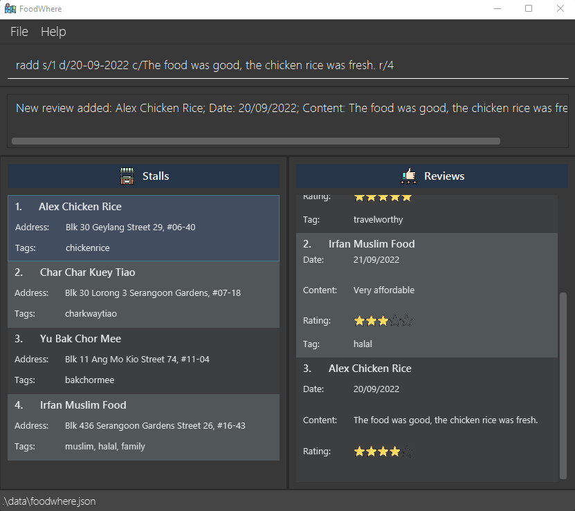

#### UML Diagram for Adding Review

The following activity diagram summarizes what happens when a user executes a new `radd` command:

#### Design considerations:
- The Review adding commands are straight to the point and efficient for users to add Review for Stall in FoodWhere.
- The prefixes allow users to understand what the different types of data fields Review need in order to be created.

### Finding stalls and reviews feature

#### What is finding stalls and reviews feature about?

This feature is used to find stalls and reviews in FoodWhere by name and/or by tags. It uses the following two commands:
* `sfind`: Finds stalls
* `rfind`: Finds reviews

`sfind` allows users to find stalls in `AddressBook` by names, through matching of input keyword(s) with stall names. Additionally, users can find stalls by tags, through matching of input keyword(s) with stall tags.

`rfind` allows users to find reviews in `AddressBook` by names, through matching of input keyword(s) with review names. Additionally, users can find reviews by tags, through matching of input keyword(s) with review tags.

For the command, the feature extends `command`, and is implemented as such:
* `sfind n/NAME_KEYWORD [MORE_KEYWORDS]… t/TAG_KEYWORD [MORE_KEYWORDS]…`
* `rfind n/NAME_KEYWORD [MORE_KEYWORDS]… t/TAG_KEYWORD [MORE_KEYWORDS]…`

#### Implementation Flow of finding stalls and reviews feature

Given below is an example usage scenario and how the finding stalls and reviews mechanism behaves at each step.

Step 1. The user launches the application for the first time. FoodWhere will be initialized with the preloaded data.

Step 2. The user executes `sfind n/eatery` command to find all stalls where stall name contains the word 'eatery'.

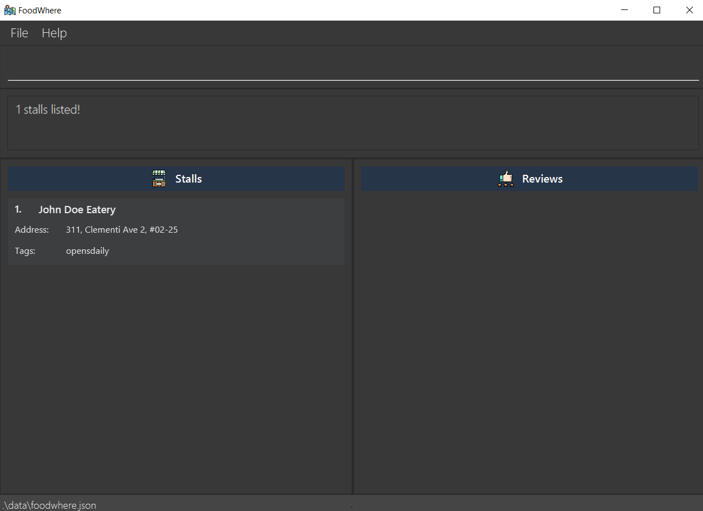

#### UML Diagram for finding stalls/ reviews

The following activity diagram summarizes what happens when a user executes a new `sfind` or `rfind` command:

#### Design considerations:
- Allow usage of multiple attributes (name and/ or tag) as search term to filter out stalls/ reviews that has the specified keywords
- Users can enter multiple search keywords to find all relevant stalls/ reviews

### Listing all Reviews feature

#### What is listing all Reviews feature about?

The listing of all reviews mechanism is facilitated by `Model`. This feature allows the user to list all reviews.

For the command, the feature extends `command`, and is implemented as such:
* `rlist`

#### Implementation Flow of listing all Reviews feature

Given below is an example usage scenario and how the listing of all reviews mechanism behaves at each step.

Note: FoodWhere comes with preloaded data, and can be started on a fresh state with the `clear` command.

Step 1. The user launches the application for the first time. FoodWhere will be initialized with the preloaded data.

Step 2. The user executes `rlist` to list all reviews on the FoodWhere User Interface.

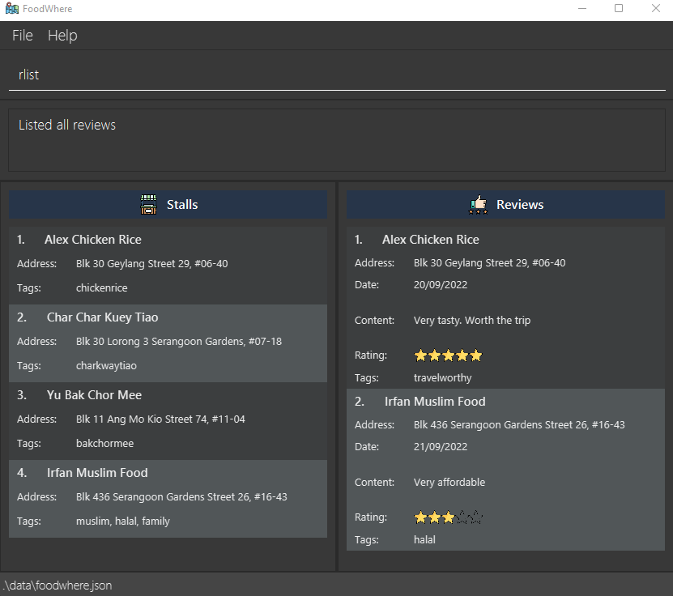

#### UML Diagram for listing of all Reviews

The following activity diagram summarizes what happens when a user executes a new `rlist` command:

### Review Deleting feature

#### What is Review Deleting feature about?

The Delete Review mechanism is facilitated by `AddressBook`. This feature allows the user to delete a review.

For the command, the feature extends `command`, and is implemented as such:
* `rdel REVIEW_INDEX`

#### Implementation Flow of Review Deleting feature

Given below is an example usage scenario and how the listing of all reviews mechanism behaves at each step.

Note: FoodWhere comes with preloaded data, and can be started on a fresh state with the `clear` command.

Step 1. The user launches the application for the first time. FoodWhere will be initialized with the preloaded data.

Step 2. The user list all the reviews by entering the `rlist` command.

Step 3. The user executes `rdel 2` command to delete the last review with index 2.

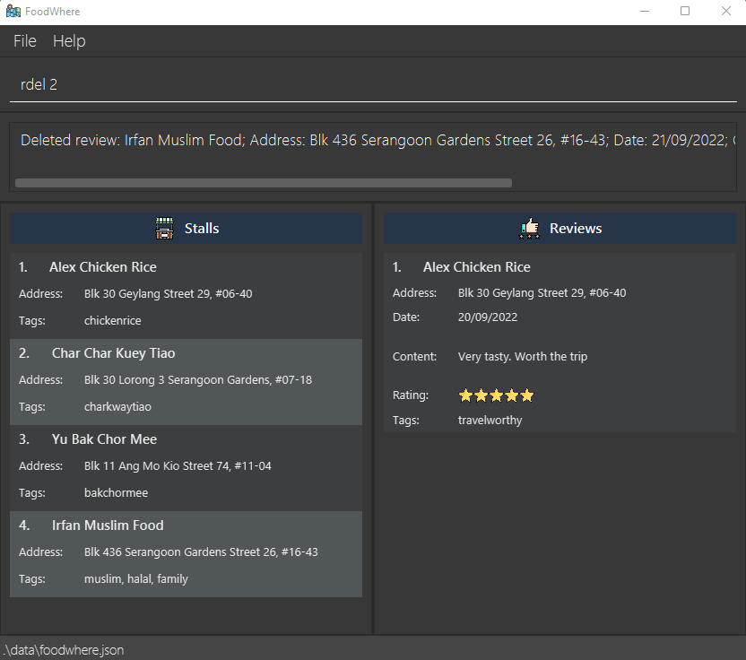

#### UML Diagram for Deleting Review

The following activity diagram summarizes what happens when a user executes a new `rdel` command:

### Review Editing feature

#### What is Review Editing feature about?

The Edit Review mechanism is facilitated by `REditCommandParser` and `REditCommand`. This feature allows the user to edit a review after it has been created.

`REditCommandParser.parse()` - parses the user input and returns a `REditCommand` object. `REditCommand.execute()` - creates a new `Review` object based on the parsed user input and calls `Model.setReview()` to replace the old `Review` object with the new `Review` object.

For the command, the feature extends `command`, and is implemented as such:
* `redit INDEX [d/DATE] [c/CONTENT] [r/RATING] [t/TAGS]…`

#### Implementation Flow of Review Editing feature

Given below is an example usage scenario and how the listing of all reviews mechanism behaves at each step.

Note: FoodWhere comes with preloaded data, and can be started on a fresh state with the `clear` command.

Step 1. The user launches the application for the first time. FoodWhere will be initialized with the preloaded data.

Step 2. The user executes `redit 2 r/5` command to edit `Review` with index 2 to edit its rating to 5.

Step 3. Since the user input is valid, the `AddressBookParser` will create a `REditCommandParser` to parse the command arguments, `2 r/5`.

Step 4. `REditCommandParser` will parse the index to a `Index` object and parse other arguments as a `EditReviewDescriptor` object. The `Index` and `EditReviewDescriptor` objects will then be passed to the returned `REditCommand` object as its arguments.

Step 5. In `LogicManager`, the returned `REditCommand` is executed.

Step 6. In the execution of the `REditCommand`, a new `Review` object is created. This `Review` consists of the field(s) from the parsed user input, replacing some field(s) of the original `Review` object. In this case, the original `Review` with index 2 is copied over to a new `Review` object except its `Rating` field which is set as `5`.

Step 7. `model.setReview()` will interact with the model to have it replace the immutable `Stall` which contained the original `Review` with a `Stall` containing the updated `Review`.

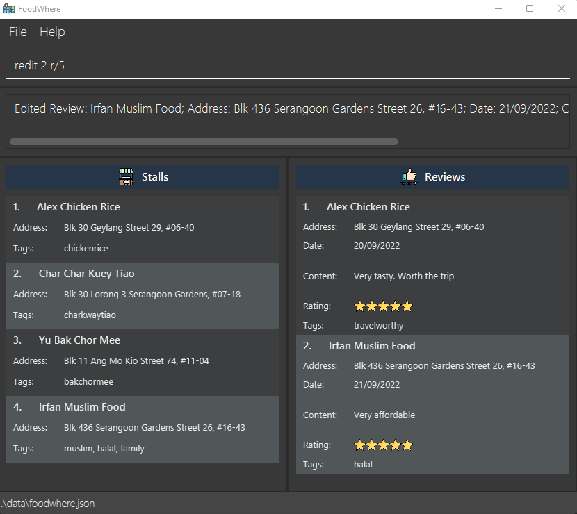

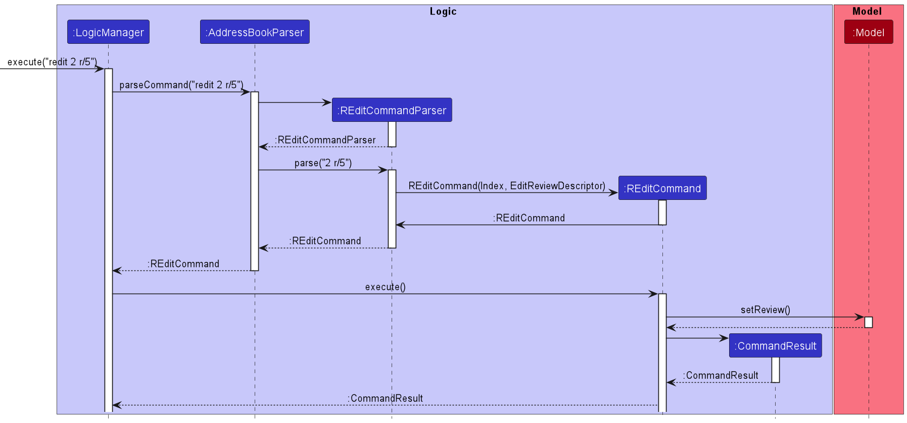

#### UML Diagram for Editing Review

The following activity diagram summarizes what happens when a user executes a new `redit` command:

#### Design considerations:
- Multiple fields of a Review can be edited in one go to increase the efficiency of the user of our application.

### \[Proposed\] Undo/redo feature

#### Proposed Implementation

The proposed undo/redo mechanism is facilitated by `VersionedAddressBook`. It extends `AddressBook` with an undo/redo history, stored internally as an `addressBookStateList` and `currentStatePointer`. Additionally, it implements the following operations:

* `VersionedAddressBook#commit()` — Saves the current address book state in its history.
* `VersionedAddressBook#undo()` — Restores the previous address book state from its history.
* `VersionedAddressBook#redo()` — Restores a previously undone address book state from its history.

These operations are exposed in the `Model` interface as `Model#commitAddressBook()`, `Model#undoAddressBook()` and `Model#redoAddressBook()` respectively.

Given below is an example usage scenario and how the undo/redo mechanism behaves at each step.

Step 1. The user launches the application for the first time. The `VersionedAddressBook` will be initialized with the initial address book state, and the `currentStatePointer` pointing to that single address book state.

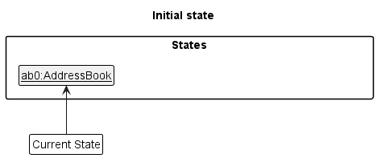

Step 2. The user executes `delete 5` command to delete the 5th stall in the address book. The `delete` command calls `Model#commitAddressBook()`, causing the modified state of the address book after the `delete 5` command executes to be saved in the `addressBookStateList`, and the `currentStatePointer` is shifted to the newly inserted address book state.

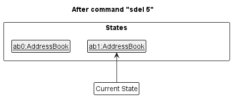

Step 3. The user executes `add n/David …​` to add a new stall. The `add` command also calls `Model#commitAddressBook()`, causing another modified address book state to be saved into the `addressBookStateList`.

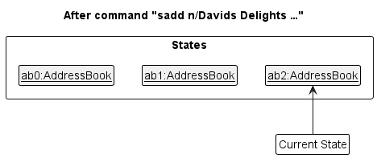

:information_source: **Note:** If a command fails its execution, it will not call `Model#commitAddressBook()`, so the address book state will not be saved into the `addressBookStateList`.

Step 4. The user now decides that adding the stall was a mistake, and decides to undo that action by executing the `undo` command. The `undo` command will call `Model#undoAddressBook()`, which will shift the `currentStatePointer` once to the left, pointing it to the previous address book state, and restores the address book to that state.

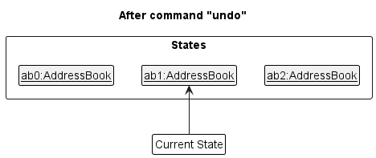

:information_source: **Note:** If the `currentStatePointer` is at index 0, pointing to the initial AddressBook state, then there are no previous AddressBook states to restore. The `undo` command uses `Model#canUndoAddressBook()` to check if this is the case. If so, it will return an error to the user rather
than attempting to perform the undo.

The following sequence diagram shows how the undo operation works:

:information_source: **Note:** The lifeline for `UndoCommand` should end at the destroy marker (X) but due to a limitation of PlantUML, the lifeline reaches the end of diagram.

The `redo` command does the opposite — it calls `Model#redoAddressBook()`, which shifts the `currentStatePointer` once to the right, pointing to the previously undone state, and restores the address book to that state.

:information_source: **Note:** If the `currentStatePointer` is at index `addressBookStateList.size() - 1`, pointing to the latest address book state, then there are no undone AddressBook states to restore. The `redo` command uses `Model#canRedoAddressBook()` to check if this is the case. If so, it will return an error to the user rather than attempting to perform the redo.

Step 5. The user then decides to execute the command `list`. Commands that do not modify the address book, such as `list`, will usually not call `Model#commitAddressBook()`, `Model#undoAddressBook()` or `Model#redoAddressBook()`. Thus, the `addressBookStateList` remains unchanged.

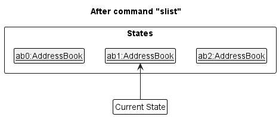

Step 6. The user executes `clear`, which calls `Model#commitAddressBook()`. Since the `currentStatePointer` is not pointing at the end of the `addressBookStateList`, all address book states after the `currentStatePointer` will be purged. Reason: It no longer makes sense to redo the `add n/David …​` command. This is the behavior that most modern desktop applications follow.

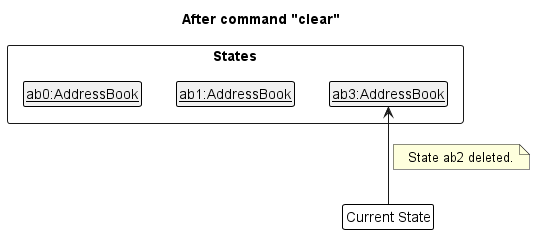

The following activity diagram summarizes what happens when a user executes a new command:

#### Design considerations:

**Aspect: How undo & redo executes:**

* **Alternative 1:** Saves the entire address book.
  * Pros: Easy to implement.
  * Cons: May have performance issues in terms of memory usage.

* **Alternative 2:** Individual command knows how to undo/redo by
  itself.
  * Pros: Will use less memory (e.g. for `delete`, just save the stall being deleted).
  * Cons: We must ensure that the implementation of each individual command are correct.

* **Alternative 3 (current choice):** Saves the entire address book, but ensuring that Stall and Review are both immutable.
  * Pros: Easy to implement, performance issues for memory are not too bad.
  * Cons: This needs Stall and Review to be guaranteed immutable, alongside all their parts. Good test cases are a must.
_{more aspects and alternatives to be added}_

### \[Proposed\] Data archiving

_{Explain here how the data archiving feature will be implemented}_

--------------------------------------------------------------------------------------------------------------------

## **Documentation, logging, testing, configuration, dev-ops**

* [Documentation guide](Documentation.md)
* [Testing guide](Testing.md)
* [Logging guide](Logging.md)
* [Configuration guide](Configuration.md)
* [DevOps guide](DevOps.md)

--------------------------------------------------------------------------------------------------------------------

## **Appendix: Requirements**

### Product scope

**Target user profile**:

* Food critics want to keep track of all the food stalls and reviews given
* has a need to manage a significant number of food stalls and reviews
* prefer desktop apps over other types
* can type fast
* prefers typing to mouse interactions
* is reasonably comfortable using CLI apps
* needs a local database to store all information

**Value proposition**:

* An application to show all the food stalls and reviews given to the particular stalls
* Commands are typed using command line
* Manage stalls faster than a typical mouse/GUI driven app
* All stalls/reviews created are stored in the local database

### User stories

Priorities: High (must have) - `* * *`, Medium (nice to have) - `* *`, Low (unlikely to have) - `*`

| Priority | As a …​                             | I want to …​                                                                                                                 | So that I can…​                                                                                                                                        |
|----------|-------------------------------------|------------------------------------------------------------------------------------------------------------------------------|--------------------------------------------------------------------------------------------------------------------------------------------------------|
| `* * *`  | user                                | create reviews for a food stall                                                                                              | record which food stall that I have visited have nice food                                                                                             |
| `* * *`  | user                                | view reviews for a food stall                                                                                                | easily find out the best food I have eaten                                                                                                             |
| `* * *`  | user                                | delete review for food stall                                                                                                 | delete any erroneous entries I have made                                                                                                               |
| `* *`    | user                                | modify details of review for food stall                                                                                      | rectify any erroneous details in the entry                                                                                                             |
| `* * *`  | user                                | list out food stall                                                                                                          | have a overview of the food stalls I have been to                                                                                                      |
| `* *`    | user                                | list out food stall according from high to low reviews                                                                       | see the top few food stall                                                                                                                             |
| `* * *`  | user                                | find food stall by substring match name                                                                                      | find the exact food stall I am interested in                                                                                                           |
| `*`      | user                                | find food stall by approximate name                                                                                          | find the exact food stall I am interested in even when I’m not very sure about the stall name                                                          |
| `*`      | user                                | tag a food stall with a tag                                                                                                  | categorize food stalls effectively                                                                                                                     |
| `*`      | user                                | list out food place according to given tag                                                                                   | get an overview of the food place with the tag i am interested in                                                                                      |
| `*`      | user                                | include photo along with the review                                                                                          | easily identify which photo belongs to which stall and upload them to social media                                                                     |
| `* * *`  | user                                | purge existing data                                                                                                          | get rid of any sample data                                                                                                                             |
| `* * *`  | user                                | add food stall addresses                                                                                                     | add a new location I can review                                                                                                                        |
| `* * *`  | user                                | delete food stall addresses                                                                                                  | remove a stall when it closes                                                                                                                          |
| `* * *`  | new user                            | see the application populated with sample data                                                                               | view what the app should look like                                                                                                                     |
| `* *`    | user                                | modify the address of a place/food stall                                                                                     | update when a hawker moves to a different place                                                                                                        |
| `*`      | user                                | find places close to my current location                                                                                     | choose where to go next effectively                                                                                                                    |
| `*`      | user                                | store individual food ratings of a place                                                                                     | see which food I have reviewed from a place                                                                                                            |
| `*`      | user                                | search food places by food type                                                                                              | organize my work to sure variety in food type in my reviews (for example, same/different types of food in the same review or to facilitate comparison) |
| `*`      | user                                | send the reviews through other social media platforms                                                                        | share the review with my friends without having to make separate posts                                                                                 |
| `* * *`  | user                                | include a date/day on my reviews                                                                                             | track how much reviewing I have done over time                                                                                                         |
| `*`      | user                                | see review that are most recent (sorting)                                                                                    | get the most updated review                                                                                                                            |
| `*`      | user                                | archive existing stalls / review                                                                                             | not be distracted by previous reviews made                                                                                                             |
| `* * *`  | new user                            | check out what tools are available in this application                                                                       | learn how to use the application                                                                                                                       |
| `* * *`  | user helping another stall, eg. Bob | import data                                                                                                                  | get existing lists from Bob to work on                                                                                                                 |
| `* * *`  | user                                | export data                                                                                                                  | archive my data entries somewhere else                                                                                                                 |
| `*`      | user                                | set a deadline to review a particular stall                                                                                  | remind myself to complete the task                                                                                                                     |
| `*`      | experienced user                    | see statistics of total number of reviews or stalls created                                                                  | keep track of my performance and targets for the year                                                                                                  |
| `*`      | user                                | include custom rating metrics on my review (star system? Health benefits?)                                                   | be more nuanced on my review                                                                                                                           |
| `* * *`  | user                                | include stall opening and closing times                                                                                      | plan my schedule on when to visit the stall accordingly                                                                                                |
| `*`      | impatient user                      | manage over 1000 stalls and reviews in reasonable time                                                                       | minimize my waiting time                                                                                                                               |
| `*`      | impatient user                      | open the app quickly                                                                                                         | not wait so long                                                                                                                                       |
| `*`      | impatient user                      | get a visualisation for any loading times                                                                                    | know how long I need to wait                                                                                                                           |
| `* *`    | user                                | search for past reviews by substring                                                                                         | see places I’ve been to before                                                                                                                         |
| `* *`    | user                                | filter for past reviews by stall                                                                                             | see places I’ve been to before                                                                                                                         |
| `*`      | advanced user                       | add command aliases                                                                                                          | speed up my workflow                                                                                                                                   |
| `*`      | user                                | plan my social media posting schedule of my current reviews   (i.e. I want to post about this stall at this future date) | manage my social media presence                                                                                                                        |                                                                                                                                                     
| `*`      | advanced user                       | access data files in csv format                                                                                              | modify the data files used in the app programmatically to do custom things                                                                             |

### Use cases

> Definition:
> - For all use cases below, the **System** is `FoodWhere` and the **Actor** is the `User`, unless specified otherwise.
> - More specifically, the `User` are **Food Critics**.

> Guarantees:
> - For any use cases below that changes any data, FoodWhere will guarantee that the data is updated and saved.
****

**Use case 1: Add a food stall**

**MSS**

1. User starts FoodWhere.
2. User requests to add a stall through an appropriate command.
3. FoodWhere adds the stall and confirms with a success message that the stall is added.

   Use case ends.

**Extensions**

* 2a. User issues the correct command with the wrong syntax.

    * 2a1. FoodWhere sends an error message to the User, indicating that the syntax is incorrect,
      and attaches the correct syntax format in the message.

      Use case ends.

****

**Use case 2: Add a food review**

**MSS**

1. User starts FoodWhere.
2. User requests to add a review through an appropriate command.
3. FoodWhere adds the review and confirms with a success message that the review is added.

   Use case ends.

**Extensions**

* 2a. User issues the correct command with the wrong syntax

    * 2a1. FoodWhere sends an error message to the User, indicating that the syntax is incorrect, and attaches the correct syntax format in the message.

      Use case ends.

****

**Use case 3: Delete a food stall**

**MSS**

1. User starts FoodWhere.
2. User requests to delete a stall through an appropriate command.
3. FoodWhere deletes the stall and confirms with a success message that the stall is deleted.

    Use case ends.

**Extensions**

* 2a. FoodWhere detects an error in the entered data. (Invalid index)
    * 2a1. FoodWhere sends an error message to the User, indicating the index used for the delete
      command is incorrect, and attaches the correct syntax format in the message.

      Use case ends.

****

**Use case 4: Delete a food review**

**MSS**

1. User starts FoodWhere.
2. User requests to delete a review through an appropriate command.
3. FoodWhere deletes the review and confirms with a success message that the review is deleted.

   Use case ends.

**Extensions**

* 2a. FoodWhere detects an error in the entered data. (Invalid index)
    * 2a1. FoodWhere sends an error message to the User, indicating the index used for the delete
      command is incorrect, and attaches the correct syntax format in the message.

      Use case ends.

****

**Use case 5: List food stalls**

**MSS**

1. User starts FoodWhere.
2. User enters the command to list food stalls.
3. FoodWhere displays all food stalls.

   Use case ends.

**Extensions**

* 2a. User uses list food stalls command with the wrong syntax.
    * 2a1. FoodWhere sends an error message to the User, indicating that the syntax is incorrect, and attaches the correct syntax format in the message.

      Use case ends.

****

**Use case 6: List food reviews**

**MSS**

1. User starts FoodWhere.
2. User enters the command to list food reviews.
3. FoodWhere displays all food reviews.

   Use case ends.

**Extensions**

* 2a. User uses list food reviews command with the wrong syntax.

    * 2a1. FoodWhere sends an error message to the User, indicating that the syntax is incorrect, and attaches the correct syntax format in the message.

      Use case ends.

****

**Use case 7: Edit a food stall**

**MSS**

1. User starts FoodWhere.
2. User enters the command to list food stalls.
3. FoodWhere displays all food stalls.
4. User enters the command to edit a particular food stall.
5. FoodWhere edits the food stall and confirms with a success message that the food stall has been edited.

   Use case ends.

**Extensions**

* 4a. FoodWhere detects an error in the entered data. (Invalid syntax or data)
    * 4a1. FoodWhere sends an error message to the User, indicating the syntax or data used for the edit food stall command is incorrect, and attaches the correct format in the message.

      Use case ends.

****

**Use case 8: Edit a food review**

**MSS**

1. User starts FoodWhere.
2. User enters the command to list food reviews.
3. FoodWhere displays all food reviews.
4. User enters the command to edit a particular food review.
5. FoodWhere edits the food review and confirms with a success message that the food review has been edited.

   Use case ends.

**Extensions**

* 4a. FoodWhere detects an error in the entered data. (Invalid syntax or data)
    * 4a1. FoodWhere sends an error message to the User, indicating the syntax or data used for the edit food review command is incorrect, and attaches the correct format in the message.

      Use case ends.

****

**Use case 9: Sort food stalls**

**MSS**

1. User starts FoodWhere.
2. User enters the command to sort food stalls by specified criterion.
3. FoodWhere displays all food stalls, sorted by the specified criterion.

   Use case ends.

**Extensions**

* 2a. FoodWhere detects an error in the entered data. (Invalid criterion)
    * 2a1. FoodWhere sends an error message to the User, indicating that the syntax is incorrect, and attaches the correct syntax format in the message.

      Use case ends.

****

**Use case 10: Sort food reviews**

**MSS**

1. User starts FoodWhere.
2. User enters the command to sort food reviews by specified criterion.
3. FoodWhere displays all food reviews, sorted by the specified criterion.

   Use case ends.

**Extensions**

* 2a. FoodWhere detects an error in the entered data. (Invalid criterion)
    * 2a1. FoodWhere sends an error message to the User, indicating that the syntax is incorrect, and attaches the correct syntax format in the message.

      Use case ends.

****

**Use case 11: Exiting the program**

**Preconditions**
- User is currently using FoodWhere.

**MSS**

1. User enters a command to exit FoodWhere.
2. FoodWhere saves all changes to disk and closes.

   Use case ends.

****

**Use case 9: Find food stalls**

**MSS**

1. User starts FoodWhere.
2. User enters the command to find food stalls.
3. FoodWhere displays the food stalls that matches the search keywords.

   Use case ends.

**Extensions**

* 2a. User chooses to search from at least one of the following fields:
    * Name
    * Tag

      Use case resumes from step 3.
* 2b. User uses find food stalls command with the wrong syntax.
    * 2a1. FoodWhere sends an error message to the User, indicating that the syntax is incorrect, and attaches the correct syntax format in the message.

      Use case ends.
****
**Use case 10: Find food reviews**

**MSS**

1. User starts FoodWhere.
2. User enters the command to find food reviews.
3. FoodWhere displays the food reviews that matches the search keywords.

   Use case ends.

**Extensions**

* 2a. User chooses to search from at least one of the following fields:
    * Name
    * Tag

      Use case resumes from step 3.
* 2b. User uses find food reviews command with the wrong syntax.
    * 2a1. FoodWhere sends an error message to the User, indicating that the syntax is incorrect, and attaches the correct syntax format in the message.

      Use case ends.

**Use case 8: Clearing data**

**Use case 12: Clearing data**

**Preconditions**
- User is currently using FoodWhere.

**MSS**

1. User enters a command to clear data from FoodWhere.
2. FoodWhere sends a confirmation message that all data is cleared and saves all changes to disk.

   Use case ends.

****

### Non-Functional Requirements

#### Data Requirements

1.  FoodWhere should be released in a single JAR file which can run independently without installation.
1.  FoodWhere's JAR file should be at most 100MB.
1.  FoodWhere's documentation should be a static PDF.
1.  FoodWhere's documentation should be at most 15MB per file.
1.  FoodWhere's documentation should include appropriate UML diagrams.
1.  FoodWhere's application data should be stored locally in human editable text files.
1.  FoodWhere's application data should be stored in the directory containing the FoodWhere JAR file, or a subdirectory of the directory containing the FoodWhere JAR file.

#### Environment Requirements

1.  FoodWhere should work on any _mainstream OS_ with Java `11` installed.
1.  FoodWhere should work on both 32-bit and 64-bit environments.
1.  FoodWhere should assume one local user.

#### Accessibility Requirements

1.  FoodWhere's UI should not play audio.
1.  FoodWhere should be usable without initializing a user account.
1.  FoodWhere should be able to run completely locally on the device.
1.  FoodWhere should be faster to use by solely typing (compared to a combination of typing and using the mouse) for a user with above average typing speed for regular English text.
1.  FoodWhere's GUI should be optimal on standard screen resolutions 1920x1080 and higher, and for screen scales 100% and 125%.
1.  FoodWhere's GUI should be usable for resolutions 1280x720 and higher, and for screen scale 150%.
1.  FoodWhere's GUI should have enough information for a new user to start using after typing the `help` command.
1.  FoodWhere should be developed in American English.
1.  All UI components in FoodWhere need to be recognisable by a user who has used GUIs before.
1.  FoodWhere should not access other devices present on the system, such as a printer or a scanner.

#### Business/Domain Rules

1.  FoodWhere stalls need to allow for the user to write multiple reviews on the stalls.

#### Performance Requirements

1.  FoodWhere should hold up to 1000 stalls and 1000 reviews while handling each command in under 1 second.
1.  FoodWhere's GUI should be functional within 5 seconds of starting, on reasonable device specifications.
1.  FoodWhere should be closed within 5 seconds of termination, on reasonable device specifications.
1.  FoodWhere's GUI should alert the user for any command that exceeds 5 seconds.

#### Fault Tolerance Requirements

1.  No ASCII text input for FoodWhere should terminate FoodWhere unexpectedly. An exception to this would be the `exit` command.
1.  FoodWhere's application data should be saved after each successfully completed command.

#### Other Requirements

1.  Images used in FoodWhere's UI need to adhere to copyright.
1.  FoodWhere's codebase should be following the Object-oriented paradigm primarily.
1.  FoodWhere's development must be strictly conducted under a framework where milestones must be met without delays and each milestone (v1.2, v1.3, v1.4) must have a usable product.
1.  FoodWhere should be developed with respect to its very specific target user profile.
1.  FoodWhere should be developed in a team.

### Glossary

* **Mainstream OS**: Windows, Linux, Unix, OS-X
* **User**: Refers to the food critic
* **Command**: Input by users that is within the Command List
* * **Review**: Refers to an entry for a particular food stall

--------------------------------------------------------------------------------------------------------------------

## **Appendix: Instructions for manual testing**

Given below are instructions to test the app manually.

:information_source: **Note:** These instructions only provide a starting point for testers to work on;
testers are expected to do more *exploratory* testing.

### Launch and shutdown

1. Initial launch

   1. Download the jar file and copy into an empty folder

   1. Double-click the jar file Expected: Shows the GUI with a set of sample contacts. The window size may not be optimum.

1. Saving window preferences

   1. Resize the window to an optimum size. Move the window to a different location. Close the window.

   1. Re-launch the app by double-clicking the jar file. 
       Expected: The most recent window size and location is retained.

1. _{ more test cases …​ }_

### Deleting a stall

1. Deleting a stall while all stalls are being shown

   1. Prerequisites: List all stalls using the `list` command. Multiple stalls in the list.

   1. Test case: `sdel 1` 
      Expected: First stall is deleted from the list. Details of the deleted stall shown in the status message. Timestamp in the status bar is updated.

   1. Test case: `sdel 0` 
      Expected: No stall is deleted. Error details shown in the status message. Status bar remains the same.

   1. Other incorrect delete commands to try: `sdel`, `sdel x`, `...` (where x is larger than the list size) 
      Expected: Similar to previous.

1. _{ more test cases …​ }_

### Saving data

1. Dealing with missing/corrupted data files

   1. _{explain how to simulate a missing/corrupted file, and the expected behavior}_

1. _{ more test cases …​ }_
